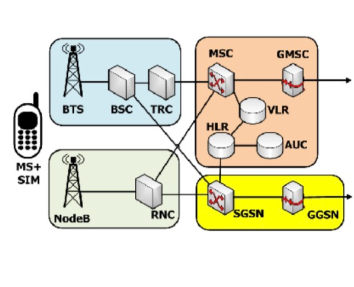
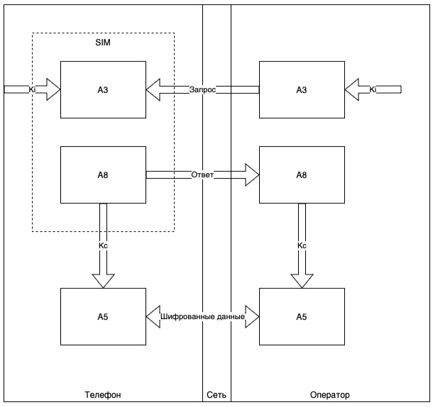
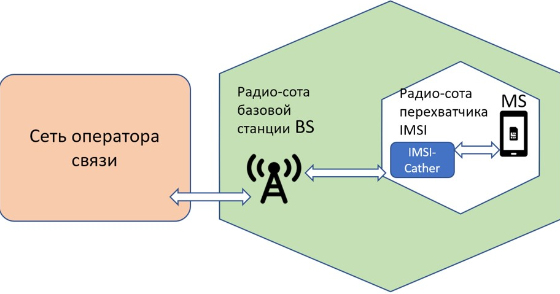
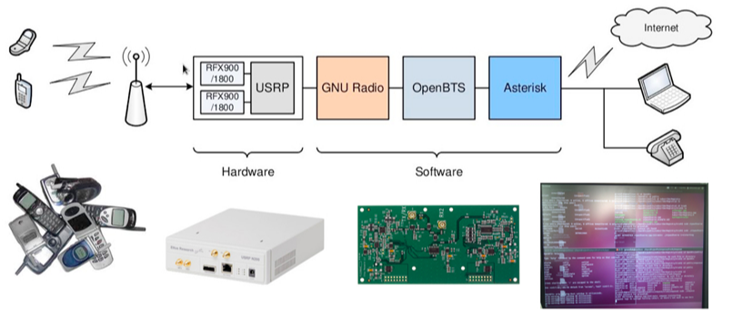

# origins2
Создание первого сайта
# Сотовая связь и атака посредника #
## Что такое атака MitM ##
«Человек посередине» (man-in-the-middle, MitM, атака посредника) — атака, при которой злоумышленник получает доступ к каналу связи между легитимными сторонами (пользователями, приложениями, сетевыми устройствами и т. д.), что позволяет ему просматривать содержимое всех передаваемых ими сообщений, удалять и изменять их.

Если говорить о сетевой коммуникации и сценарии, когда у злоумышленников по умолчанию нет к ней доступа, то они могут:
взломать сервис или устройство, имеющее этот доступ, например роутер;
выдать себя за легитимного участника сетевой коммуникации: приложение, веб-сайт, VPN-сервер, точку доступа и т. д.
Среди методов, позволяющих направить трафик жертвы через ресурсы злоумышленников, можно выделить следующие:
Фальшивые точки доступа: злоумышленники создают незапароленные точки доступа к Wi-Fi или, например, точки доступа с именами, похожими на имена легитимных точек доступа, в расчете, что жертва попытается к ним подключиться. В случае успеха весь интернет-трафик жертвы будет проходить через устройство злоумышленников.
«Отравление» кэша ARP: злоумышленники транслируют по локальной сети соответствие между IP-адресом легитимного устройства и MAC-адресом своего устройства. Эта атака имеет смысл, если у атакующих есть доступ к локальной сети жертвы.
Подмена DNS: злоумышленники меняют DNS-кэш (записи о соответствии между доменными именами, то есть адресами сайтов, и IP-адресами серверов, на которых расположены эти сайты) на роутере или уязвимом DNS-сервере, устанавливая соответствие между определенными доменными именами и подконтрольными им IP-адресами. Если пользователь пытается открыть в браузере соответствующий сайт, он попадает на ресурс злоумышленников, который, как правило, полностью копирует дизайн оригинального сайта.
Спуфинг URL-адреса: злоумышленники создают поддельные ресурсы с URL-адресами, похожими на URL легитимного ресурса. Если пользователь вместо легитимного откроет сайт злоумышленников, они могут выступать в роли «посредника» между пользователем и легитимным сайтом.

В мобильных сетях связи атака MitM может называться «IMSI catcher» или «false base station»

На приведённой картинке изображена общая структура сетей сотовой связи. Изначально сеть разделяется на 2 больших подсети — сеть радиодоступа **(RAN — Radio Access Network)** и сеть коммутации или опорную сеть **(CN — Core Network)**.

Существующие сети радиодоступа — продукт долгой эволюции, поэтому они состоят из сети радиодоступа к **GSM (GERAN — GSM EDGE Radio Access Network)** и сети радиодоступа к **UMTS (UTRAN — UMTS Terrestrial Radio Access Network)**. Сверху слева на картинке **GERAN**, внизу слева, **UTRAN**. За счёт сети радиодоступа обеспечивается то огромное покрытие, которое предоставляют сети сотовой связи.

Опорная сеть — ядро сетей сотовой связи, разделена на 2 части — верхняя правая часть отвечает за голосовые соединения, или **CS-соединения (Circuit Switch)**, нижняя правая часть отвечает за пакетные соединения, или же **PS-соединения (Packet Switch)**. Опорная сеть сосредоточена в одном или нескольких зданий, принадлежащих оператору сотовой связи, в больших машинных залах.

**HLR — Home Location Register**, Регистр положения домашних абонентов. По сути это большая база данных, в которой хранится всё (может ли абонент совершать исходящие звонки, может ли абонент отправлять/принимать **SMS**, разрешена ли услуга конференц-связи и все остальные услуги, идентификатор того **MSC**, в зоне действия которого сейчас находится абонент) об абоненте данной сети.
**MSC — Mobile Switching Center**, центр коммутации для мобильных абонентов. Основные его функции — для исходящего вызова — определить куда переключить вызов, для входящего же соединения — определить на какой **BSC** отправить вызов.
**VLR — Visitor Location Register**, регистр положения гостевых абонентов. **VLR** хранит в себе копию тех данных, которые записаны в HLR с той лишь разницей, что тут уже нет информации о том **MSC**, в зоне действия которого находится абонент. Здесь хранится информация о том, в зоне действия какого **BSC** находится данный абонент.
**AUC — Authentication Center**, центр аутентификации абонентов. Этот узел отвечает за то, чтобы злоумышленник не мог получить доступ к сети от вашего лица. Также этот узел генерирует ключи шифрования, с помощью которых шифруется ваше соединение с сетью в самом уязвимом месте — на радиоинтерфейсе. Иногда выделяется **EIR (Equipment Identity Register - реестр идентификации оборудования)** — допуск к эксплуатации в сети только разрешенных сотовых
телефонов.
**GMSC — Gateway MSC**, шлюзовой коммутатор. Этот узел сети используется только при входящих вызовах.
**SGSN — Serving GPRS Support Node**, обслуживающий узел поддержки **GPRS**. Этот узел отвечает за то, чтобы определить каким образом предоставлять услуги на основе запрошенной **APN (Access Point Name, точки доступа)**
**GGSN — Gateway GPRS Support Node**, шлюзовой узел поддержки **GPRS**. Отвечает за правильную доставку пакетов до пользователя.
**BSC — Base Station Controller**, контроллер базовых станций. Узел, к которому подключаются базовые станции, дальше он осуществляет управление базовыми станциями — назначает какому абоненту где сколько ресурсов выделить, определяет каким образом осуществляются хэндоверы. 
**TRC — TRansCoder**, транскодер. Устройство, отвечающее за перекодирование речи из формата **GSM** в стандартный формат телефонии, используемый в фиксированных сетях связи и обратно. Речь передаётся в формате сетей фиксированной связи в сети **GSM** на участке от **GMSC** до **TRC**.
**BTS — Base Transceiver Station**, базовая приёмопередающая станция. 
**RNC — Radio Network Controller**, контроллер сети радиодоступа. Той же, что **BS**C в **GERAN**.
NodeB, базовая станция в UMTS. Аналог BTS в GSM.
## Регистрация в сети ##
При каждом включении телефона после выбора сети начинается процедура регистрации. Рассмотрим наиболее общий случай - регистрацию не в домашней, а в чужой, так называемой гостевой, сети (будем предполагать, что услуга роуминга абоненту разрешена). 
Пусть сеть найдена. По запросу сети телефон передает **IMSI абонента ( международный идентификатор мобильного абонента)**. **IMSI** начинается с кода страны "приписки" его владельца, далее следуют цифры, определяющие домашнюю сеть, а уже потом - уникальный номер конкретного подписчика. Например, начало IMSI 25099… соответствует российскому оператору Билайн. (250-Россия, 1 - МТС, 2, 11, 14 - МегаФон, 20 - Теле2, 99 - Билайн). По номеру **IMSI VLR** гостевой сети определяет домашнюю сеть и связывается с ее **HLR (домашний регистр местоположения)**. Последний передает всю необходимую информацию об абоненте в **VLR ( временная база данных в сотовой сети, которая хранит информацию об абонентах)**, который сделал запрос, а у себя размещает ссылку на этот **VLR**, чтобы в случае необходимости знать, "где искать" абонента.

При регистрации **AuC**домашней сети генерирует 128-битовое случайное число - RAND, пересылаемое телефону. Внутри **SIM** **(модуль идентификации абонента)** с помощью ключа **Ki (ключ идентификации - так же как и IMSI, он содержится в SIM)** и алгоритма идентификации А3 вычисляется 32-битовый ответ - **SRES (Signed RESult)** по формуле **SRES = Ki * RAND**. Точно такие же вычисления проделываются одновременно и в **AuC** (по выбранному из HLR Ki пользователя). Если **SRES**, вычисленный в телефоне, совпадет со **SRES**, рассчитанным **AuC**, то процесс авторизации считается успешным и абоненту присваивается **TMSI (Temporary Mobile Subscriber Identity-временный номер мобильного абонента)**. **TMSI** служит исключительно
для повышения безопасности взаимодействия подписчика с сетью и может периодически меняться (в том числе при смене VLR).
Теоретически, при регистрации должен передаваться и номер **IMEI (Международная идентификация мобильного оборудования)**, при получении **IMEI** сетью, он направляется в **EIR**, где сравнивается с так называемыми "списками" номеров. Белый список содержит номера санкционированных к использованию телефонов, черный список состоит из **IMEI**, украденных или по какой-либо иной причине не допущенных к эксплуатации телефонов, и, наконец, серый список - "трубки" с проблемами, работа которых разрешается системой, но за которыми ведется постоянное наблюдение.

После процедуры идентификации запускается счетчик времени, задающий момент перерегистрации в случае отсутствия каких-либо сеансов связи. Обычно период обязательной регистрации составляет несколько часов. Перерегистрация необходима для того, чтобы сеть получила подтверждение, что телефон по-прежнему находится в зоне ее действия. Дело в том, что в режиме ожидания "трубка" только отслеживает сигналы, передаваемые сетью, но сама ничего не излучает - процесс передачи начинается только в случае установления соединения, а также при значительных перемещениях относительно сети — в таких случаях таймер, отсчитывающий время до следующей
перерегистрации, запускается заново. Поэтому при "выпадении" телефона из сети (например, был отсоединен аккумулятор, или владелец аппарата зашел в метро, не выключив телефон) система об этом не узнает.
## Маршрутизация вызовов ##
Рассмотрим теперь, каким образом происходит маршрутизация входящих вызовов мобильного телефона. Как и раньше, будем рассматривать наиболее общий случай, когда абонент находится в зоне действия гостевой сети, регистрация прошла успешно, а телефон находится в режиме ожидания.
При поступлении запроса на соединение от проводной телефонной (или другой сотовой) системы на **MSC (центр коммутации мобильной связи)** домашней сети (вызов "находит" нужный коммутатор по набранному номеру мобильного абонента **MSISDN (уникальный номер мобильного телефона который содержит код страны и сети)**.
**MSC** пересылает в **HLR (централизованная база данных оператора мобильной связи)** номер (MSISDN) абонента. **HLR**, в свою очередь, обращается с запросом к **VLR (регистр местоположений посетителей)** гостевой сети, в которой находится абонент. **VLR** выделяет один из имеющихся в ее распоряжении **MSRN (Mobile Station Roaming Number - номер "блуждающей" мобильной станции)**. Идеология назначения **MSRN** очень напоминает динамическое присвоение адресов **IP (NAT) технология трансляции сетевых адресов** при коммутируемом доступе в Интернет через модем. **HLR** домашней сети получает от **VLR** присвоенный абоненту **MSRN** и, сопроводив его **IMSI** пользователя, передает коммутатору домашней сети. Заключительной стадией установления соединения является направление вызова, сопровождаемого **IMSI** и **MSRN (номер роуминга мобильной станции)**, коммутатору гостевой сети, который формирует специальный сигнал, передаваемый по **PAGCH (PAGer CHannel - канал вызова)** по всей **LA (область местоположения)**, где находится абонент.
## Подробнее про безопасность ##
В стандарте **GSM (глобальная система мобильной связи, или 2G)** аналоговые данные преобразуются в цифровые данные и передаются в этом же формате. Именно этот формат передачи обеспечивает необходимый уровень безопасности, которым обладают сети **GSM**.
Общая безопасность сотовой связи **GSM** включает в себя как технические и организационные моменты, так и правовые. Для обеспечения как можно более полной защиты все эти три составляющие должны находиться в тесном взаимодействии.
Под термином «безопасность» в стандарте **GSM** мы понимаем защиту системы от несанкционированного доступа и обеспечение секретности переговоров абонентов. В первую очередь техническую безопасность обеспечивает совокупность алгоритмов, которые используются для организации соединения абонента с сетью оператора **GSM**. На рисунке ниже представлена схема такого соединения.

В основе безопасности **GSM** лежат три алгоритма, которые являются официально закрытыми, те. секретными:

- A3 - алгоритм аутентификации;
- А8 - алгоритм генерации ключа шифрования для сеанса связи;
- A5 - алгоритм шифрования сигнала в процессе сеанса связи. Аутентификация - уточнение подлинности абонента. Механизм аутентификации заключается в том, что сеть **GSM** посылает запрос с случайным числом на мобильную станцию (телефон абонента), мобильная станция шифрует это число алгоритмом А3, используя **ключ шифрования Кі**, который в свою очередь записан на **SIM-карте абонента (модуль подлинности абонента)**. Зашифрованный запрос отправляется от мобильной станции обратно оператору. Полученный ответ проверяется на правильность: оператор проводит такое же шифрование случайного числа, отправленного на мобильную станцию. Если полученный результат совпадает с ответом с мобильной станции, то считается, что аутентификация прошла успешно.
Ответ, который был получен после работы алгоритма А3, требуется для определения ключа шифрования Кс. Этот ключ позволяет передавать все сообщения в режиме защиты информации. Зашифрованный ответ поступает в алгоритм А8, который в свою очередь, при помощи некоторых преобразований, вычисляет ключ Кс. Подобное действие производится и оператором, что обеспечивает идентичность ключа на стороне оператора и стороне мобильной станции.
Кроме случайного числа сеть отправляет мобильной станции числовую последовательность ключа шифрования. Это число связано с действительным значением Кс и позволяет избежать генерации неверного ключа. Число хранится мобильной стацией и содержится в каждом первом сообщении, которое передается в сеть.
Установка режима шифрования возможна, когда сеть передает мобильной станции команду **СМС (Команда режима шифрования)** на переход к режиму шифрования. Как только мобильная станция получает команду **СМС**, она приступает процессу дешифрования) с использованием имеющегося у нее ключа. Данные шифруются поточным шифром A5 и ключом шифрования Кс.
Для обеспечения секретности каждому абоненту присваивается временный международный номер пользователя **(TMSI)**, который актуален только в зоне расположения абонента. При перемещении в другую зону абоненту при-свивается новый **TMSI**. После завершения аутентификации и в начале шифрования **TMSI** передается на мобильную станцию только зашифрованным. Этот **TMSI** будет использоваться при всех следующих доступах к системе.
За все положения безопасности в сети **GSM** отвечает центр аутентификации **(AUC)**. Этот центр может либо входить в состав оборудования сети, например регистры местоположения **HLR (о база данных оператора мобильной связи)**, **VLR (Реестр местоположения посетителей)**, либо может быть автономным объектом. Представим ряд задач, которые может решать **AUC**:
- формирование **ключей аутентификации Кі** и соответствующих им международных идентификационных номеров абонентов **(IMSI)**;
- формирование случайного числа, ответа и ключа шифрования Кс для каждого **IMSI**, а так же открытие этих групп для HLR при необходимости.
При перемещении мобильной станции в новую зону расположения, новому **VLR** необходимо получить секретную информацию об этой мобильной станции. Выполняется это следующим образом:
- мобильная станция проводит идентификацию по собственному **IMSI**, при этом **VLR** запрашивает группы данных случайного числа, ответа и ключа шифрования Кс у регистра **HLR**, которые принадлежат данному **IMSI**.
- мобильная станция проводит аутентификацию, при этом используя прежний временный номер **TMSI** с указанием зоны расположения.
Новый **VLR** запрашивает прежний **VLR** для посылки международного номера **IMSI** и групп данных случайного числа, ответа и ключа шифрования Кс, которые принадлежат этому **TMSI** и зоне рас-положения.

Режим шифрования в сети **GSM** вводит специальные требования к мобильным станциям. Например, ключ аутентификации **Кі**, который неразрывно связан с международным идентификационным номером абонента **IMSI**, требует довольно высокой степени защиты.
Модуль подлинности абонента, т.е. **SIM-карта**, содержит в себе всю информацию об абоненте. **SIM-карта** представляет собой небольшой пластиковый шаблон с встроенной электронной схемой - чипом. Каждой **SIM-карте** присвоен собственный индивидуальный идентификационный номер PIN, который позволяет отклонить несанкционированное использование **SIM**. Основные характеристики **SIM** определены в Рекомендации GSM 02.17.
Меры безопасности в сети **GSM** применяются для того, чтобы избежать несанкционированных доступов к данным абонентов подвижной связи.
Противоправные действия обычно направлены на два основных аспекта:
1. Действия направлены на получения доступа к передаваемым данным абонента, будь то голосовые данные или текстовые;
Для того чтобы получить информацию о закрытых данных абонента, необходимо иметь довольно сложно оборудование, которое позволяло бы получить доступ к оборудованию абонента таким образом, чтобы абонент сам об этом не догадывался. Такое оборудования является дорогостоящим и доступно отнюдь не каждому человеку.
Так же, хотелось бы заметить, что доступ к закрытым данным является по закону неправомерным деянием и рассматривается как мошенническое действие. Проводить подобные операции по получению личных данных абонента можно лишь в случаях, связанных с силовыми органами страны.
Те. на основаниях суда, полостью законного, оператор вправе предоставить личную информацию абонента третьим лицам в случаях, когда это является необходимым.
2. Действия направлены на получение бесплатного доступа к сети связи.
Данная ситуация гораздо проще предыдущей. Получить бесплатный доступ к сети связи можно посредством чужого телефонного аппарата, как бы глупо это не звучало. Телефонные аппараты могут быть украдены или потеряны, таким образом доступ к SIM-карте становится полностью открытым.
В таких случаях операторы связи советуют сразу же блокировать SIM-карты временными блокировками, которые не позволят другим лицам использовать Ваш телефон по назначению. Такие блокировки запрещают совершать какие-либо действия, будь то голосовой вызов или отправка текстового сообщения. В дальнейшем Вы можете восстановить эту же SIM-Карту со всеми Вашими данными, при этом блокировка связи будет сразу же снята, что позволит Вам пользоваться связью как и раньше.
В заключении хотелось бы отметить, что механизмы, которые выбраны в сети для поддержания секретности, а так же методы их реализации,
определили основные элементы передаваемой информации и пути передачи, на которых должно осуществляться шифрование. В данном стандарте нет строгих рекомендаций формирование закрытых групп абонентов и системы приоритетов. При организации систем связи имеется некоторая свобода в применении аспектов безопасности.

## Атака посредника ##

### Принцип атаки ###
Атака обычно начинается с прослушивания канала связи и заканчивается тем, что криптоаналитик пытается подменить перехваченное сообщение, извлечь из него полезную информацию, перенаправить его на какой-нибудь внешний ресурс.
Предположим, объект A планирует передать объекту B некую информацию. Объект C обладает знаниями о структуре и свойствах используемого метода передачи данных, а также о факте планируемой передачи собственно информации, которую С планирует перехватить. Для совершения атаки С «представляется» объекту А как В, а объекту В — как А. Объект А, ошибочно полагая, что он направляет информацию В, посылает её объекту С. Объект С, получив информацию и совершив с ней некоторые действия (например, скопировав или модифицировав в своих целях), пересылает данные собственно получателю — В; объект В, в свою очередь, считает, что информация была получена им напрямую от А.
### Пример атаки на алгоритмическом языке ###
Атака «человек посередине»
Предположим, что Алиса хочет передать Бобу некоторую информацию. Мэлори хочет перехватить сообщение и, возможно, изменить его так, что Боб получит неверную информацию.
Мэлори начинает свою атаку с того, что устанавливает соединение с Бобом и Алисой, при этом они не могут догадаться о том, что кто-то третий присутствует в их канале связи. Все сообщения, которые посылают Боб и Алиса, проходят через Мэлори.
Алиса просит у Боба его открытый ключ. Мэлори представляется Алисе Бобом и отправляет ей свой открытый ключ. Алиса, считая, что это ключ Боба, шифрует им сообщение и отправляет его Бобу. Мэлори получает сообщение, расшифровывает, затем изменяет его, если нужно, шифрует его открытым ключом Боба и отправляет его ему. Боб получает сообщение и думает, что оно пришло от Алисы:
1. Алиса отправляет Бобу сообщение, которое перехватывает Мэлори: Алиса «Привет, Боб, это Алиса. Пришли мне свой открытый ключ.» → Мэлори Боб
2. Мэлори пересылает сообщение Бобу; Боб не может догадаться, что это сообщение не от Алисы: Алиса Мэлори «Привет, Боб, это Алиса. Пришли мне свой открытый ключ.» → Боб
3. Боб посылает свой ключ: Алиса Мэлори ← [ключ Боба] Боб
4. Мэлори подменяет ключ Боба своим и пересылает сообщение Алисе: Алиса ← [ключ Мэлори] Мэлори Боб
5. Алиса шифрует сообщение ключом Мэлори, считая, что это ключ Боба, и только он может расшифровать его: Алиса «Встречаемся на автобусной остановке!» [зашифровано ключом Мэлори] → Мэлори Боб
6. Мэлори расшифровывает сообщение, читает его, модифицирует его, шифрует ключом Боба и отправляет его: Алиса Мэлори «Жди меня у входа в музей в 18:00.» [зашифровано ключом Боба] → Боб
7. Боб считает, что это сообщение Алисы.
Этот пример демонстрирует необходимость использования методов для подтверждения того, что обе стороны используют правильные открытые ключи, то есть что у стороны А открытый ключ стороны B, а у стороны B — открытый ключ стороны А. В противном случае, канал может быть подвержен атаке «человек посередине».
### Краткая схема атаки ###
Перехват вызовов с помощью перехватчиков IMSI (IMSI Cathers)
IMSI Cather – это подслушивающее устройство для перехвата мобильного телефонного трафика и для отслеживания перемещений мобильного абонента. По сути, это «фейковая» базовая станция, которая встраивается в радиоканал между абонентом и настоящей базовой станцией мобильного оператора. 

Оборудование, используемое для атаки «с одной стороны» выглядит как базовая станция с ограниченными возможностями по шифрованию взаимодействия (на экране телефона иногда отображается «открытый замок» — нет шифрования), «с другой» — как телефон абонента. «Базовой станцией» оборудование контактирует с жертвой, при этом необходимо быть довольно близко или иметь очень сильную антенну, так как телефон абонента будет (и всегда это делает, в том числе в процессе разговора) пытаться перейти на БС с сильнейшим сигналом. «Телефоном» оборудование контактирует с настоящей базовой станцией оператора, позволяя осуществлять жертве вызов. Между «базовой станцией» и «телефоном» обычно выполняется запись разговора. 
### OpenBTS ###
OpenBTS.org — это открытый проект c исходным кодом на GitHub, призванный провести революцию среди мобильных сетей путем замены устаревших телекоммуникационных протоколов и традиционно сложных запатентованных аппаратных систем использованием Интернет-протокола и программного обеспечения с гибкой архитектурой. Архитектура этой системы является открытой для инноваций, позволяя любому желающему разрабатывать новых приложения и сервисы на базе OpenBTS и значительно упрощает настройку и эксплуатацию сети мобильной связи.
OpenBTS использует программное обеспечение GNURadio, чтобы создать GSM радиоинтерфейс для поддержки мобильных аппаратов, работающих в стандарте 2G GSM и использует протокол SIP коммутатора или АТС для подключения звонков. Можно даже сказать, что это OpenBTS упрощенная форма IMS, которая работает с 2G-функциональными телефонами. Сочетание глобальной стандарта GSM с недорогим VoIP соединением формирует основу нового типа сотовой сети, которая может быть развернута и эксплуатироваться со значительно меньшими затратами, чем существующие технологии во многих приложениях. 

Проект был запущен Харвиндом Самра и Давидом А. Бургессом. И изначально основной их задачей было снижение GSM услуг в бедных странах и регионах, а также возможностью быстрого создания собственной мобильной сети на отдаленных от цивилизации территориях. 
Постепенно проект стал больше ориентироваться на частные компании и коммерческие организации с целью обезпечения внутренней мобильной сети.
Также стоит отметить что разработчики, работающие над проектом, во время ранней работы над OpenBTS и связанными проектами, сталкивались с ныне решёнными вопросами правовых претензий. Фактически, это повлекло за собой то, что часть кода низкоуровневой работы (взаимодействия) с GSM была переписана «с нуля». 
Преимущества использования OpenBTS: защищенность внутренней корпоративной сети OpenBTS, которая передается через мобильные устройства от внешних операторов мобильной связи;
возможность настроить собственную мобильную сеть в районах с плохим мобильным покрытием.
Блягодаря тому, что OpenBTS можно относительно легко и дешево развернуть, его используют для атаки MitM. Он маскируется под обычную базовую станцию и через него проходит вся информация.
### Применение на практике ###
В 2014 году сразу в трёх скандинавских странах — Норвегии, Швеции и Финляндии — вспыхнул громкий скандал, после того как журналисты норвежской газеты **Aftenposten** провели замеры электронного трафика в правительственном квартале Осло, где, помимо канцелярии премьер-министра и парламента, располагаются посольства ряда крупных государств. Одна из фальшивых базовых станций располагалась напротив посольства РФ в Осло, давая возможность отслеживать телефонный трафик его сотрудников. Полиция безопасности Норвегии **(PST)** по просьбе **Aftenposten** проверила информацию и подтвердила наличие ложных базовых станций в правительственном квартале, после чего было начато расследование фактов шпионажа, доказанных журналистами. После публикации Aftenposten сигналы **IMSI-ловушек** прекратились. Вслед за норвежскими журналистами соответствующие измерения произвели их финские и шведские коллеги. В правительственных кварталах Хельсинки и Стокгольма также были обнаружены ложные базовые станции неизвестного происхождения. В качестве наиболее вероятных хозяев ловушек называют США и собственную полицию. Ранее Эдвард Сноуден заявлял, что Агентство национальной безопасности США широко использует **IMSI-перехватчики** как для отслеживания возможных террористов (подобные установки действуют во всех аэропортах США), так и для шпионажа за чиновниками других государств, в том числе и союзных. **IMSI-ловушки** доступны на открытом международном рынке, но запрещены к продаже в странах Северной Европы.
Технология перехвата метаданных мобильного телефона является недорогой и широко используется в полиции, правительственных учреждениях и даже широкой общественностью. В январе 2016 г. устройства перехвата были обнаружены по всему Лондону, в том числе в пределах диапазона мониторинга посольства Эквадора, предоставившее в 2012 г. основателю **WikiLeaks** Джулиану Ассанжу политическое убежище.
### Используемая литература ###
- https://habr.com/ru/articles/82757/
- https://asvk.cs.msu.ru/wp-content/uploads/2023/04/Seti-GSM.pdf
- https://cyberleninka.ru/article/n/bezopasnost-setey-svyazi-standarta-gsm
- https://shalaginov.com/2023/02/25/mobile-networks-vulnerabilities-overview/
- https://github.com/RangeNetworks/dev/wiki
- https://myseldon.com/ru/news/index/136019798
